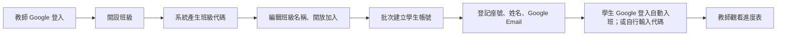
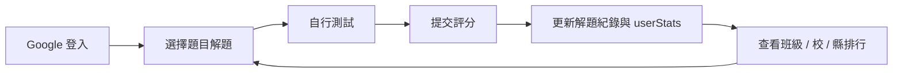
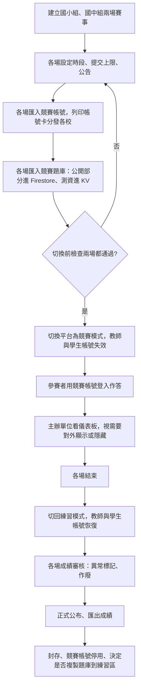
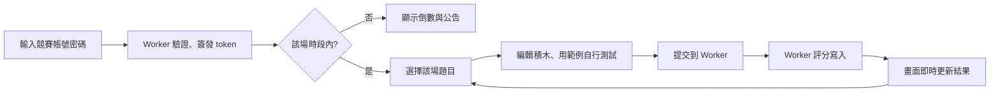

# 宜蘭縣資訊科技創意實作競賽平台系統規格書 v3.0

## 1. 文件資訊

| 項目 | 內容 |
| --- | --- |
| 文件名稱 | 宜蘭縣資訊科技創意實作競賽平台系統規格書 |
| 文件版本 | v3.0（2026-09-19 實作版；第 1–16 章為 2026-09-15 規劃內容，實作差異見第 17 章） |
| 基礎版本 | v2.0（2026-09-15，目前實作版） |
| 撰寫日期 | 2026-09-15 |
| 線上網站 | https://ilanictexam.pages.dev |
| 前端技術 | React、TypeScript、Vite、自訂 CSS |
| 後端與資料 | Firebase Authentication、Cloud Firestore、Cloudflare Worker `ilanictexam-grader` + KV |
| 部署平台 | Cloudflare Pages（正式 main／預覽 v3-dev）+ Cloudflare Workers |
| 程式碼 | https://github.com/ychiechao/ilanICTExam |

本文件在 v2.0 的基礎上，加入「平台雙模式」設計：平時為練習模式，由教師開班帶學生練習；賽事期間由主辦單位（超級管理者）切換為競賽模式，教師與學生帳號全部失效，只有主辦單位匯入的競賽帳號可以登入作答。

已確認的設計前提：

1. 使用者只有三種：超級管理者、教師、學生。
2. 教師的工作流程：開設班級 → 產生班級代碼 → 編輯班級 → 批次建立學生帳號（登記姓名與 Google Email，學生用 Google 登入即自動入班）→ 觀看學生解題進度。學生也可以自己輸入班級代碼加入。
3. 學生的工作流程：解題 → 解題紀錄 → 班級排行 → 校排行 → 縣排行。
4. 競賽模式下，教師與學生帳號一律無效；超管匯入「競賽帳號」與「競賽題庫」，帳號密碼由主辦單位列印分發，參賽者用競賽帳號登入。
5. 同一時間有國小組、國中組兩場賽事並行，各有獨立帳號、題庫、時段與排行榜。
6. 競賽為全縣正式賽事，成績必須安全可信：競賽評分一律在 Cloudflare Worker 執行，隱藏測資不進入任何前端可讀的資料。
7. 競賽期間只有主辦單位可以看參賽者進度；主辦單位可決定把進度儀表板對外顯示或隱藏。

## 2. 標示說明

本文件每個功能或資料項目都標示其狀態：

| 標示 | 意義 |
| --- | --- |
| 【現有】 | v2.0 已完成，本版不變 |
| 【修改】 | v2.0 已有，本版需要調整行為、欄位或權限 |
| 【新規劃】 | 本版新增，尚未實作 |
| 【延伸】 | 列入未來設計，本版不做 |

未加標示的段落為說明文字。

## 3. 系統定位【修改】

本平台是一套 Blockly 積木程式解題平台，具有兩種運作模式：

1. **練習模式**（平時）：學生解題、查看紀錄與班級 / 校 / 縣三層排行；教師開班、登記學生、追蹤進度。所有人以 Google 登入，評分在瀏覽器執行（現有做法）。
2. **競賽模式**（賽事期間）：國小組、國中組兩場並行。教師與學生帳號無效，只有主辦單位匯入的競賽帳號可登入，作答該場題庫；成績由 Worker 評分，主辦單位審核後才公布。

兩種模式由主辦單位在後台一鍵切換，所有已登入使用者的畫面即時跟隨切換。

v2.0 的「賽事管理」只有後台的狀態欄位，對前台沒有任何作用；v3.0 把這個狀態變成整個平台的行為開關，並補上獨立競賽帳號、獨立競賽題庫、伺服器端評分、三層排行、進度儀表板與稽核紀錄。

## 4. 平台模式【新規劃】

### 4.1 模式定義

| 模式 | 說明 | 誰能登入 | 誰能作答 |
| --- | --- | --- | --- |
| `practice` | 練習模式，預設狀態 | 超管、教師、學生 | 學生 |
| `contest` | 競賽模式 | 超管、競賽帳號 | 該場競賽帳號，只能作答自己那一場 |
| `maintenance` | 維護模式，只顯示公告 | 超管 | 無 |

### 4.2 平台狀態資料

新增單一文件 `settings/platform` 作為全站模式的唯一真相來源：

| 欄位 | 型別 | 說明 |
| --- | --- | --- |
| `mode` | `practice` / `contest` / `maintenance` | 目前模式 |
| `activeContestIds` | string[] | 競賽模式時列出進行中的賽事（國小組與國中組兩個 id），其他模式為空陣列 |
| `announcement` | string | 顯示於所有使用者畫面頂端的公告 |
| `updatedAt` | timestamp | 由 Firestore 伺服器時間寫入 |
| `updatedBy` | string | 操作的超管 uid |

- 任何人可讀（未登入者也需要，才能在登入頁顯示「目前為競賽模式」），只有超管可寫。
- 前端以 `onSnapshot` 訂閱，超管切換後所有線上使用者畫面即時更新。
- Firestore Rules 會讀取此文件決定各集合的權限，因此「教師與學生帳號無效」是資料層的封鎖，不只是前端隱藏畫面。
- 每場賽事各自有狀態（等候開始、競賽中、暫停、結束）與時段；平台模式只決定「現在是不是競賽期間」，單場的暫停或提前結束不影響另一場。

### 4.3 各模式行為矩陣

| 功能 | 練習模式 | 競賽模式 | 維護模式 |
| --- | --- | --- | --- |
| 超管 Google 登入 | 開放 | 開放 | 開放 |
| 教師 Google 登入 | 開放 | 登入後只看到公告，所有資料讀寫被 Rules 拒絕 | 同左 |
| 學生 Google 登入 | 開放 | 同上 | 同上 |
| 競賽帳號登入 | 關閉 | 開放 | 關閉 |
| 練習題目、提交、紀錄 | 開放 | 關閉 | 關閉 |
| 班級 / 校 / 縣排行 | 開放 | 關閉 | 關閉 |
| 教師班級管理與進度 | 開放 | 關閉 | 關閉 |
| 競賽題目、提交 | 關閉 | 該場競賽帳號 | 關閉 |
| 進度儀表板 | 關閉 | 主辦單位永遠可看；對外依主辦單位開關 | 關閉 |
| 超管後台 | 開放 | 開放 | 開放 |
| 匯入競賽帳號與題庫 | 開放（賽前準備） | 開放（賽事開始前完成） | 開放 |

### 4.4 切換流程與防呆

超管切換到競賽模式時，勾選要啟用的賽事（國小組、國中組），系統對每一場檢查：

1. 賽事狀態為「等候開始」或「競賽中」。
2. 競賽題庫已匯入且至少一題，測資已在 Worker KV。
3. 競賽帳號已匯入且至少一個。
4. 賽事時段已設定，且結束時間晚於現在。

任一項不符合則不允許切換並顯示原因。切換動作寫入 `auditLogs`。

切回練習模式時：

1. 所有仍為「競賽中」的賽事自動移到「結束」。
2. `activeContestIds` 清空。
3. 所有競賽帳號的登入 session 失效（Worker 拒絕該場的 token 換發）。
4. 競賽題庫維持只有超管可見，直到賽後處理決定是否複製到練習題庫（8.10）。

## 5. 使用者與帳號【修改】

### 5.1 三種使用者

| 使用者 | 登入方式 | 練習模式權限 | 競賽模式權限 |
| --- | --- | --- | --- |
| 超級管理者（主辦單位） | Google | 模式切換、帳號管理、競賽設定、題庫、學校、所有資料 | 同左，另加進度儀表板、審核 |
| 教師 | Google（`tmail.ilc.edu.tw`） | 開設班級、產生代碼、編輯班級、批次建立學生帳號、觀看學生解題進度 | 無（帳號無效） |
| 學生 | Google（`smail.ilc.edu.tw`） | 解題、解題紀錄、班級 / 校 / 縣排行、加入班級 | 無（帳號無效） |

「競賽帳號」不是第四種使用者，而是主辦單位為單場賽事匯入的臨時身分，只在競賽模式有效，賽後即失效（8.2）。

### 5.2 登入方式【新規劃】

v2.0 只有 Google 登入。v3.0 新增「競賽帳號登入」，只在競賽模式使用：

| 情境 | 登入方式 | 帳號來源 | 有效期間 |
| --- | --- | --- | --- |
| 超管、教師、學生 | Google | 現有 | 練習模式（超管不限） |
| 參賽者 | 競賽帳號 `組別代碼-流水號`，例如 `E-107`（國小）、`J-023`（國中）+ 密碼 | 超管匯入，主辦單位列印分發 | 只在該場賽事啟用時 |

競賽帳號登入流程：

1. 前端把帳號、密碼送到 Worker `/login`。
2. Worker 查 `contestAccounts`，比對 KV 中的密碼雜湊。
3. 比對成功後 Worker 以服務帳號簽發 Firebase 自訂 token，token 內含 claims：`accountType = "contest"`、`contestId`、`username`、`schoolId`、`displayName`。
4. 前端用 `signInWithCustomToken` 登入 Firebase，之後所有 Firestore 存取與 Google 登入者走同一條路。
5. Firestore Rules 直接用 `request.auth.token.accountType`、`request.auth.token.contestId` 判斷權限，不需要額外查名單。

練習模式沒有本機帳號：教師「批次建立學生帳號」是登記姓名與 Google Email（7.4），學生仍用自己的 Google 帳號登入。

### 5.3 競賽模式下教師與學生帳號無效的實作

- Rules：模式為 `contest` 時，所有練習相關集合（`problems`、`submissions`、`userProblemStats`、`userStats`、`classes`、`classMembers`、`classSubmissionViews`、練習排行榜）對非超管一律拒絕讀寫。
- 前端：教師與學生登入後只看到公告頁「目前為競賽期間，練習平台暫停」，沒有任何功能入口。
- Worker：`/login` 只服務競賽帳號，且只在競賽模式、該場賽事啟用時接受登入。

## 6. 功能總覽

| 模組 | 狀態 | 說明 |
| --- | --- | --- |
| Google 登入 | 【現有】 | 超管、教師、學生 |
| 競賽帳號登入 | 【新規劃】 | 經 Worker 簽發 Firebase 自訂 token |
| 題目練習、自行測試、提交評分、解題紀錄 | 【現有】 | 練習模式下維持前端評分 |
| 三層排行（班級 / 校 / 縣） | 【新規劃】 | 取代 v2.0 的單題榜與全站榜 |
| 教師：開設班級、產生代碼、編輯班級 | 【現有】 | 維持 v2.0，補上編輯名稱與封存 |
| 教師：批次建立學生帳號 | 【新規劃】 | 登記座號、姓名、Google Email；學生 Google 登入即自動入班 |
| 教師：觀看學生解題進度 | 【修改】 | v2.0 的答題紀錄改為「學生 × 題目」進度表 |
| 超管：帳號管理 | 【修改】 | 教師與學生管理維持 v2.0；新增競賽帳號管理 |
| 超管：平台模式切換 | 【新規劃】 | 後台「平台狀態」區塊 |
| 超管：競賽設定 | 【修改】 | 每場賽事的時段、提交上限、儀表板設定 |
| 超管：匯入競賽帳號 | 【新規劃】 | 每場獨立匯入，產生密碼，匯出帳號卡 |
| 超管：匯入競賽題庫 | 【新規劃】 | 每場獨立匯入，測資只存 Worker KV |
| 競賽作答頁 | 【新規劃】 | 倒數計時、該場題目、提交次數、公告 |
| Worker 評分管線 | 【新規劃】 | 縣賽必要 |
| 競賽排行榜 | 【新規劃】 | 每場獨立，只由 Worker 寫入 |
| 進度儀表板 | 【新規劃】 | 主辦單位專用；可對外顯示或隱藏；投影用不登入畫面 |
| 成績審核與匯出 | 【新規劃】 | 異常標記、作廢、匯出 CSV |
| 稽核紀錄 | 【新規劃】 | 超管操作與參賽者作答期間的異常事件 |
| 競賽題複製到練習題庫 | 【新規劃】 | 賽後由超管操作 |
| 班級舊資料回填工具 | 【新規劃】 | 補建功能上線前的班級答題紀錄 |
| 教師觀賽、PK 對戰、徽章 | 【延伸】 | 不在本版範圍 |

## 7. 練習模式功能

### 7.1 解題模式【現有】

維持 v2.0：題目清單與篩選、Blockly / Scratch 風格積木、本機自動儲存、自行測試、前端 Web Worker 評分、每題最多 10 次提交。

### 7.2 解題紀錄【現有】

維持 v2.0：個人每題的提交紀錄、最佳分數、通過率、執行時間。

### 7.3 三層排行【新規劃】

學生可切換三個範圍的排行榜：

| 排行 | 範圍 | 資料來源 |
| --- | --- | --- |
| 班級排行 | 我所在的班級（若加入多個班級可切換） | `userStats` 中 `classIds` 包含該班級者 |
| 校排行 | 我所屬學校的所有學生 | `userStats` 中 `schoolId` 相同者 |
| 縣排行 | 全平台所有學生 | `userStats` 全部 |

排序依據：總分 → 完成題數 → 最後提交時間（早者優先）。

每位學生一份 `userStats/{uid}` 彙總文件，每次提交後由前端更新自己的那一份（Rules 只允許寫自己的），內容包含總分、完成題數、各題最佳分數、`schoolId`、`classIds`、最後提交時間。排行榜讀取時直接查詢此集合，不再維護 v2.0 的每題前 50 名文件。

學生的 `schoolId` 來源：加入班級時（不論預登記或輸入代碼）寫入該班級的學校。沒有加入任何班級的學生只出現在縣排行。

單題排行榜【延伸】：本版不做，若需要可在題目頁另加。

### 7.4 教師：班級管理【修改】

教師登入後的「我的班級」依工作流程排列：

**開設班級 → 產生代碼**【現有】

建立班級時自動產生 6 碼班級代碼。學生可用代碼自行加入（Google 登入者）。

**編輯班級**【修改】

可修改班級名稱、開放或關閉代碼加入、封存班級。封存後學生看不到該班排行，資料保留。

**批次建立學生帳號**【新規劃】

學生都有 Google 帳號（`smail.ilc.edu.tw`），因此「建立帳號」實際上是預先登記，讓學生第一次 Google 登入就自動進班，不必再輸入代碼：

1. 教師在班級頁選「批次建立學生帳號」，貼上或上傳名單：座號、姓名、Google Email。
2. 前端檢查格式與重複後，直接在 `classMembers` 建立 `status = pending` 的預登記文件（含 `normalizedEmail`、`seatNumber`、`studentName`），不需要 Worker。
3. 學生用 Google 登入時，前端查詢 `classMembers` 中 `normalizedEmail` 等於自己 Email 且 `status = pending` 的文件，寫入自己的 uid 並改為 `active`；`users` 文件同時帶入該班級的 `schoolId`。Rules 只允許本人對 Email 相符的 pending 文件做這個轉換。
4. 教師在學生名單看到「已登入 / 尚未登入」狀態，可提醒尚未登入的學生。
5. 教師可移除學生、修改座號與姓名；學生 Google 帳號的顯示名稱以教師登記的姓名為準（避免學生自訂暱稱）。
6. 學生也可以不經登記，直接在「我的帳號」輸入班級代碼加入（現有）；此時 `seatNumber` 為空，教師可事後補填。

**觀看學生解題進度**【修改】

v2.0 的「答題紀錄」列表改為「進度表」：

- 橫軸為題目（可依年度、類別篩選），縱軸為班級學生。
- 每格顯示狀態：未作答 / 部分（顯示最佳分數）/ 滿分，並可點開看該生該題的提交紀錄。
- 上方統計：每題完成人數、每位學生完成題數與總分。
- 資料來源仍為 `classSubmissionViews`，讓教師只讀到自己班級的資料。
- 可匯出 CSV。

### 7.5 練習題庫【修改】

`problems` 集合定位為「練習題庫」。來源有兩種：

- 超管直接新增、編輯、匯入（現有）。
- 從已結束的賽事複製（新規劃，見 8.10）。複製時保留 `sourceContestId` 與 `sourceContestProblemId`，隱藏測資變成練習用一般測資，由前端評分。

### 7.6 班級舊資料回填工具【新規劃】

超管後台新增「回填班級答題紀錄」按鈕：掃描所有 `classMembers`（status = active），對每位學生撈其 `submissions`，補建缺少的 `classSubmissionViews` 與 `userStats`。執行結果顯示補建筆數，並寫入 `auditLogs`。

## 8. 競賽模式功能【新規劃】

### 8.1 賽事設定

每場賽事（例如「115 年國小組」「115 年國中組」）各自擁有：

- 名稱、年度、組別代碼（`E` 國小、`J` 國中）、時段、每題提交上限、公告
- 獨立的競賽帳號 `contestAccounts`
- 獨立的競賽題庫 `contestProblems` 與 KV 測資
- 獨立的提交、排行榜、儀表板

### 8.2 匯入競賽帳號

1. 超管在後台選擇賽事，上傳名單：學校、姓名、（選填）座位或報名序號。
2. 前端送到 Worker `/contest-accounts/{contestId}`，Worker 驗證超管身分。
3. Worker 對每列產生帳號 `組別代碼-三位流水號`（例如 `E-001`）與隨機 8 碼密碼，密碼雜湊後寫入 `contestAccounts`。
4. 回傳一次性的帳號密碼清單，前端提供「下載 CSV」與「列印帳號卡」（每張含賽事名稱、學校、姓名、帳號、密碼、登入網址）。
5. 超管可對單一帳號「重設密碼」「停用」「解除裝置綁定」。
6. 匯入可分批（例如各校名單陸續送達），流水號接續。
7. 賽事進入「競賽中」後仍可新增帳號（處理現場臨時狀況），但寫入 `auditLogs`。

競賽帳號與學生的 Google 帳號、班級帳號完全無關；主辦單位不需要事先知道學生的 Email。

### 8.3 競賽登入

- 登入頁在競賽模式顯示「競賽帳號登入」表單（帳號、密碼），不顯示 Google 登入按鈕給非超管（超管走另一個入口）。
- Worker `/login` 檢查：模式為 `contest`、帳號所屬 `contestId` 在 `activeContestIds`、帳號未停用、密碼正確。
- 首次登入記錄 `firstLoginAt` 與瀏覽器指紋；之後若指紋不同，記錄 `contestEvents` 供審核（不阻擋，避免現場誤判）。
- 自訂 token 有效期 1 小時，前端在到期前自動向 Worker 換發；賽事結束或切回練習模式後 Worker 拒絕換發。

### 8.4 競賽作答頁

競賽帳號登入後看到：

- 頂端：賽事名稱、參賽者姓名與學校、倒數計時（以 Worker `/time` 校正）、公告。
- 左側：該場題目清單，顯示每題目前最佳分數與剩餘提交次數。
- 中央：與練習模式相同的積木編輯區與自行測試（自行測試在瀏覽器執行，只用範例測資）。
- 「提交評分」：送出後顯示「評分中」，結果由 Worker 回寫後即時更新。
- 「儀表板」分頁：只在主辦單位開放時出現。

賽事時段外畫面只顯示公告與倒數，提交按鈕停用。

### 8.5 提交與評分

競賽提交一律經 Worker：

1. 前端把 `problemId`、`blocklyXml`、`generatedCode` 與 Firebase ID token 送到 Worker `/grade`。
2. Worker 驗證 token、從 token claims 取得 `contestId` 與帳號、確認模式為 `contest`、確認該場在 `activeContestIds` 且時段內、確認提交次數未超過上限、依帳號限速。
3. Worker 從 KV 取得完整測資並執行評分。
4. Worker 以服務帳號寫入 `contestSubmissions`（伺服器時間戳），更新該場排行榜與儀表板快照。
5. 前端訂閱自己的 `contestSubmissions` 即時看到結果。

前端只收到每筆測資的「通過 / 不通過」與該筆分數；隱藏測資的輸入、預期輸出與實際輸出一律不回傳。

### 8.6 匯入競賽題庫

1. 超管在後台選擇賽事，上傳題庫 JSON（格式與現有 `bdesigner_114_problems.json` 相容，含 `test_cases`）。
2. 前端送到 Worker `/contest-problems/{contestId}`。
3. Worker 把每題拆成兩部分：
   - **公開部分**（題號、標題、說明、輸入輸出格式、範例測資、難度、測資筆數、滿分）寫入 Firestore `contestProblems`。
   - **評分測資**（全部，含隱藏）寫入 KV `cases:{contestId}:{problemId}`。
4. Firestore 從頭到尾不含隱藏測資的輸入與答案。
5. 匯入結果（題數、警告、缺測資的題目）顯示於後台並寫入 `auditLogs`。
6. 賽事進入「競賽中」後 Worker 拒絕再次匯入，避免中途換題。

### 8.7 競賽排行榜

```
leaderboards/contest/{contestId}/entries/{uid}
```

- 每場獨立。只由 Worker 寫入。
- 排序依據：總分 → 完成題數 → 完成總耗時（從賽事開始到最後一次滿分提交）→ 總提交次數。
- 讀取權限跟隨儀表板開關（8.9）；未開放時只有超管可讀。
- 賽事「正式公布」後，該場競賽帳號可讀最終榜（含作廢後重算結果）。

### 8.8 成績審核與公布

賽事狀態進入「成績審核」後，超管後台提供（每場各自審核）：

- 每位參賽者總分、各題分數、提交次數、完成時間、學校。
- 異常標記：同一份 `codeHash` 出現在多位參賽者、提交時間集中在結束前數秒、`contestEvents` 中裝置指紋變更或切換分頁次數異常。
- 手動調整：對單筆提交標記「作廢」並填寫原因，Worker 重算排行榜。
- 匯出 CSV：學校、姓名、帳號、各題分數、總分、名次。

超管按「正式公布」後，賽事狀態變為 `published`。

### 8.9 進度儀表板

主辦單位專用的即時進度畫面，每場一份，資料來源為 Worker 每次評分後寫入的快照 `contestDashboards/{contestId}`。

**內容**

- 總覽：已登入人數 / 帳號數、已提交人數、各題完成人數、平均分數。
- 排行榜：前 N 名。
- 學校統計：各校參賽人數、完成題數、平均分。
- 各題狀態：每題「未作答 / 部分 / 滿分」人數。
- 最近提交：最新 20 筆。

**顯示或隱藏**

賽事資料的 `dashboard` 設定：

| 欄位 | 說明 |
| --- | --- |
| `visibility` | `organizer`（預設，只有超管）/ `participants`（該場競賽帳號可看）/ `public`（任何已登入者可看） |
| `showNames` | 對外顯示時是否顯示姓名，否則只顯示學校與帳號 |
| `topN` | 對外排行榜顯示名次數 |
| `boardToken` | 投影用畫面的 token |

超管在儀表板頁面一鍵切換 `visibility`，切換寫入 `auditLogs`。設為 `organizer` 時，`contestDashboards` 與競賽排行榜的 Rules 只允許超管讀取；參賽者端的「儀表板」分頁即時消失。

**投影用畫面**

Worker 提供 `GET /board/{contestId}?token=...`，回傳不需登入的唯讀頁面，每 10 秒自動更新。token 由超管產生，隨時可作廢；`visibility` 為 `organizer` 時此端點回傳「主辦單位尚未開放」。

### 8.10 稽核與異常紀錄

**`auditLogs`**：超管操作紀錄。模式切換、賽事狀態變更、帳號匯入、題庫匯入、儀表板開關、密碼重設、成績作廢都寫一筆，內容含操作者、伺服器時間、動作、對象、變更摘要。只有超管可讀，不可修改或刪除。

**`contestEvents`**：參賽者作答期間的客戶端事件。前端記錄 `visibility_hidden` / `visibility_visible`（切換分頁）、`paste`、`workspace_import`、`submit`（含 `codeHash`）；Worker 記錄 `login`、`fingerprint_changed`、`token_refresh_denied`。參賽者只能建立自己的事件，不能讀取或修改。不做即時阻擋，供賽後審核。

### 8.11 賽後處理

賽事狀態進入「封存」時，超管可選擇：

1. **複製到練習題庫**：後台按「複製到練習題庫」，Worker `/release/{contestId}` 從 KV 取出完整測資，連同 `contestProblems` 的公開部分，寫成新的 `problems` 文件（狀態 `draft`，保留 `sourceContestId`）。超管在練習題庫檢查後再發布。
2. **保持封存**：題庫留在賽事底下，只有超管可見。

競賽帳號在封存後全部停用；競賽提交、排行榜、儀表板快照、稽核紀錄永久保留。

## 9. 評分與安全架構【修改】

### 9.1 目前（v2.0）

評分全部在瀏覽器執行，分數由客戶端寫入 Firestore。Rules 只檢查 `uid` 是自己，不檢查分數合理性。隱藏測資與全部題目對任何人可讀。練習用途可接受，縣賽不行。

### 9.2 目標：Worker 為競賽期間唯一的寫入者【新規劃】

```
瀏覽器（競賽帳號）          Cloudflare Worker                  Firebase / KV
  │                             │                              │
  │ POST /login                 │                              │
  │ {帳號, 密碼}                 │ 查 contestAccounts、比對雜湊 ─►│ Firestore
  │────────────────────────────►│ 簽發自訂 token（含 contestId） │
  │◄────────────────────────────│                              │
  │ signInWithCustomToken ──────────────────────────────────────►│ Auth
  │                             │                              │
  │ POST /grade                 │                              │
  │ {problemId, code, xml}      │                              │
  │ + ID token                  │                              │
  │────────────────────────────►│ 1. 驗證 ID token、讀 claims    │
  │                             │ 2. 讀 settings/platform ─────►│ Firestore
  │                             │ 3. 讀提交次數、限速 ─────────►│ Firestore / KV
  │                             │ 4. 讀完整測資 ───────────────►│ KV
  │                             │ 5. 執行測資（逾時、輸出上限）  │
  │                             │ 6. 寫 contestSubmissions ────►│ Firestore
  │                             │    寫 leaderboards/contest ──►│ Firestore
  │                             │    寫 contestDashboards ─────►│ Firestore
  │ {ok, submissionId}          │                              │
  │◄────────────────────────────│                              │
  │ onSnapshot 取得結果 ◄────────────────────────────────────────│
```

**安全設計要點（縣賽必要）**

| 威脅 | 對策 |
| --- | --- |
| 教師或學生在競賽期間存取資料 | Rules 在 `contest` 模式對非超管、非競賽帳號的所有讀寫一律拒絕 |
| 直接寫分數到 Firestore | `contestSubmissions`、競賽排行榜、儀表板快照禁止客戶端寫入，只有 Worker 的服務帳號能寫 |
| 讀到隱藏測資答案 | 測資只存 KV；`contestProblems` 不含隱藏測資；評分結果只回傳通過與否 |
| 冒用他人競賽帳號 | 密碼雜湊（Argon2 或 bcrypt）；帳號密碼只在匯入時顯示一次；裝置指紋變更記錄供審核 |
| 偽造身分提交 | Worker 驗證 Firebase ID token 簽章；`contestId` 與帳號以 token claims 為準，不信任請求內容 |
| 跨場作答 | token claims 的 `contestId` 決定能讀哪一場的 `contestProblems` 與能提交哪一場 |
| 時段外提交 | Worker 以自身時鐘判斷；前端倒數只是顯示 |
| 超過提交次數 | Worker 讀取已提交筆數後才評分；同一帳號同一題並發請求以 KV 鎖序列化 |
| 無限迴圈或超大輸出 | 每筆測資獨立逾時、輸出長度上限 |
| 大量請求 | Worker 依帳號限速（每 5 秒 1 次提交、每分鐘 10 次登入） |
| 抄襲 | 每筆提交存 `codeHash`，審核頁比對重複 |
| 賽後帳號外流 | 切回練習模式即拒絕 token 換發；封存時全部停用 |
| 主辦單位操作爭議 | 所有超管操作寫 `auditLogs`，不可修改刪除 |

**額度與成本**

- Worker 以 Firebase 服務帳號透過 Firestore REST API 寫入、簽發自訂 token，屬 Spark 免費方案可用範圍；不需要 Cloud Functions 或 Blaze。
- Cloudflare Workers 免費額度每日 10 萬次請求、每次 CPU 10 ms。以兩場各 200 人、每人 5 題、每題 10 次提交計算，一天最多 2 萬次評分請求加登入與換發，遠低於額度。單題測資執行若超過 CPU 限制，改用 Workers Paid（每月 5 美元，CPU 30 秒）；實作前要先用實際題目量測。
- KV 免費額度每日 10 萬次讀取，足夠。
- 執行環境仍是 V8，`prompt` / `alert` / `console.log` 代理邏輯可從現有 Web Worker 直接沿用。

### 9.3 練習模式的評分維持前端【現有】

練習模式的提交、`userStats`、班級答題紀錄由前端寫入，Rules 只限制「只能寫自己的」。練習排行榜若有人竄改，影響的只是練習成績，不影響縣賽。

## 10. 資料模型

### 10.1 現有集合【現有】

| 集合 | 用途 | 本版變更 |
| --- | --- | --- |
| `users` | 使用者基本資料、角色、狀態、學校 | 無 |
| `admins` | 超管與教師管理資料 | 無 |
| `settings` | 系統設定 | 新增 `platform` 文件 |
| `problems` | 練習題庫 | 新增 `sourceContestId`、`sourceContestProblemId` |
| `contests` | 賽事 | 新增多個欄位（10.3） |
| `schools` | 學校 | 無 |
| `contestRoster` | 賽事名單 | **移除**，由 `contestAccounts` 取代 |
| `schoolAccounts` | 學校預先匯入帳號 | **移除**，由教師批次登記學生取代 |
| `classes` | 班級 | 新增 `archived`（已有欄位，補 UI） |
| `classMembers` | 班級成員 | 新增 `seatNumber`、`normalizedEmail`、`registeredBy`；`status` 新增 `pending` |
| `classSubmissionViews` | 教師可讀的班級答題紀錄 | 無 |
| `submissions` | 練習提交紀錄 | 明確只存練習資料 |
| `userProblemStats` | 使用者每題統計 | 明確只存練習資料 |
| `leaderboards` | 排行榜 | 練習榜移除，改用 `userStats`；競賽榜改為子集合 |

### 10.2 新增集合【新規劃】

| 集合 | 用途 | 讀 | 寫 |
| --- | --- | --- | --- |
| `settings/platform` | 全站模式 | 任何人 | 超管 |
| `userStats/{uid}` | 學生練習彙總，供三層排行 | 已登入（練習模式） | 本人 |
| `contestAccounts/{accountId}` | 競賽帳號（密碼雜湊存 KV） | 超管 | Worker |
| `contestProblems` | 競賽題庫的公開部分 | 超管；token `contestId` 相符的競賽帳號 | Worker |
| KV `cases:{contestId}:{problemId}` | 競賽題完整測資 | Worker | Worker |
| `contestSubmissions` | 競賽提交紀錄 | 超管、本人 | Worker |
| `contestDashboards/{contestId}` | 儀表板快照 | 超管；依 `dashboard.visibility` | Worker |
| `leaderboards/contest/{contestId}/entries` | 競賽排行榜 | 超管；依 `dashboard.visibility`；公布後該場競賽帳號 | Worker |
| `auditLogs` | 超管操作紀錄 | 超管 | 超管與 Worker 建立、不可改刪 |
| `contestEvents` | 參賽者作答期間事件 | 超管 | 本人與 Worker 建立、不可改刪 |

### 10.3 欄位規格【修改】

**`contests` 新增欄位**

| 欄位 | 型別 | 說明 |
| --- | --- | --- |
| `division` | `E` / `J` | 國小組 / 國中組 |
| `maxSubmissionsPerProblem` | number | 每題提交上限，預設 10 |
| `accountCount`、`problemCount` | number | 已匯入帳號數、題數 |
| `casesSyncedAt` | timestamp | 題庫最後匯入 KV 的時間 |
| `dashboard` | map | `{ visibility, showNames, topN, boardToken }` |
| `publishedAt` | timestamp | 正式公布時間 |
| `releasedToPractice` | boolean | 賽後是否已複製到練習題庫 |

**`contestAccounts` 欄位**

| 欄位 | 說明 |
| --- | --- |
| `contestId`、`username`（例如 `E-001`） | 關聯與帳號 |
| （密碼雜湊） | 存於 KV `pw:{accountId}`，Firestore 不放 |
| `name`、`schoolId`、`schoolName`、`note` | 參賽者資料 |
| `status` | `active` / `disabled` |
| `uid` | Firebase 自訂 token 的 uid，固定為 `contest_{contestId}_{username}` |
| `firstLoginAt`、`lastLoginAt`、`deviceFingerprint` | 登入資訊 |
| `createdAt`、`createdBy`、`batchId` | 匯入資訊 |

**`userStats` 欄位**

| 欄位 | 說明 |
| --- | --- |
| `uid`、`displayName`、`schoolId`、`classIds[]` | 排行分組依據 |
| `totalScore`、`completedCount`、`attemptedCount` | 彙總 |
| `problemScores` | `{ problemId: bestScore }` |
| `lastSubmittedAt`、`updatedAt` | 時間 |

**`contestProblems` 欄位**

| 欄位 | 說明 |
| --- | --- |
| `contestId`、`order` | 所屬賽事與題序 |
| `title`、`description`、`inputFormat`、`outputFormat`、`difficulty` | 題目說明 |
| `examples` | 範例測資（公開） |
| `caseCount`、`maxScore` | 供前端顯示；測資內容不在此 |

**`contestSubmissions` 欄位**

| 欄位 | 說明 |
| --- | --- |
| `contestId`、`problemId`、`uid`、`username`、`schoolId` | 關聯 |
| `score`、`maxScore`、`passedCases`、`totalCases`、`status` | 評分結果 |
| `caseResults` | 每筆只含 `caseTitle`、`passed`、`earnedScore`、`visibility` |
| `blocklyXml`、`generatedCode`、`codeHash` | 程式內容（供審核） |
| `elapsedMs`、`createdAt` | 執行時間、伺服器時間戳 |
| `voided`、`voidReason`、`voidedBy`、`voidedAt` | 審核作廢 |

## 11. Firestore Rules 變更清單【修改】

Rules 引入兩個共用判斷：

- `mode()`：`get(/settings/platform).data.mode`
- `isContestAccount(contestId)`：`request.auth.token.accountType == "contest" && request.auth.token.contestId == contestId`

| 集合 | v2.0 | v3.0 |
| --- | --- | --- |
| `settings/platform` | 不存在 | 任何人可讀；超管可寫 |
| 所有練習集合（`problems`、`submissions`、`userProblemStats`、`userStats`、`classes`、`classMembers`、`classSubmissionViews`） | 各自規則 | 原規則之外，加上 `mode() == "practice" || isSuperAdmin()`；競賽帳號一律拒絕 |
| `classMembers` | 教師管理自己班級、學生可建立自己的 | 另加：教師可為自己班級建立 `pending` 預登記；學生可把 `normalizedEmail` 等於自己 Email 的 pending 文件改為 active 並寫入自己的 uid（只能改這兩個欄位） |
| `problems` | 任何人可讀 | 已登入可讀（練習模式） |
| `userStats` | 不存在 | 已登入可讀；本人可寫自己的（練習模式） |
| `contestAccounts` | 不存在 | 超管可讀；客戶端不可寫。密碼雜湊存 KV，Firestore 只放非敏感欄位 |
| `contests` | 只有超管 | 超管全權；競賽帳號可讀自己那一場的公開欄位 |
| `contestProblems` | 不存在 | 超管可讀；`isContestAccount(resource.data.contestId)` 且 `mode() == "contest"` 可讀；客戶端不可寫 |
| `contestSubmissions` | 不存在 | 超管；本人可讀；客戶端不可寫 |
| `contestDashboards` | 不存在 | 超管；`visibility == participants` 時該場競賽帳號；`visibility == public` 時已登入；客戶端不可寫 |
| `leaderboards/contest` | 不存在 | 同儀表板；公布後該場競賽帳號可讀 |
| `leaderboards/{problemId}`（v2.0 練習榜） | 任何啟用帳號可整份覆寫 | **移除** |
| `auditLogs` | 不存在 | 超管可讀、可建立；不可 update / delete |
| `contestEvents` | 不存在 | 本人可建立（`uid` 必須是自己、`createdAt` 必須是 `request.time`）；超管可讀；不可 update / delete |

因為競賽身分由 token claims 決定，Rules 不需要查名單文件，每次讀寫只多一次 `settings/platform` 讀取。

## 12. 部署架構【修改】

```
┌──────────────────────────────────────────────────────┐
│ Cloudflare Pages（現有）                               │
│   React 前端，dist/                                    │
│   練習模式：Google 登入、前端評分                        │
│   競賽模式：競賽帳號登入、呼叫 Worker 評分               │
└───────────────┬──────────────────────────────────────┘
                │
┌───────────────▼──────────────────────────────────────┐
│ Cloudflare Worker：ilanictexam-grader（新規劃）          │
│   POST /login                    競賽帳號登入 → 自訂 token │
│   POST /refresh                  token 換發              │
│   POST /contest-accounts/{id}    超管匯入競賽帳號         │
│   POST /contest-problems/{id}    超管匯入題庫 → 拆分      │
│   POST /grade                    驗 token → 評分 → 寫入   │
│   POST /void                     超管作廢提交並重算        │
│   POST /release/{id}             賽後複製到練習題庫        │
│   POST /reset-password           超管重設競賽帳號密碼      │
│   GET  /time                     伺服器時間               │
│   GET  /board/{id}               投影用不登入儀表板        │
│   Secrets：Firebase 服務帳號 JSON                       │
│   KV：contest-cases（測資）、passwords（雜湊）、locks     │
└───────────────┬──────────────────────────────────────┘
                │ Firestore REST API + Auth 自訂 token
┌───────────────▼──────────────────────────────────────┐
│ Firebase 專案 fileupload-d96f5（現有）                  │
│   Authentication：Google 登入 + 自訂 token              │
│   Firestore：所有集合 + firestore.rules                 │
└──────────────────────────────────────────────────────┘
```

本機開發：無 Firebase 設定時仍可退回 localStorage 示範模式（現有）；Worker 本機用 `wrangler dev` 搭配 Firebase Emulator。

## 13. 主要操作流程

### 13.1 教師練習流程【修改】



### 13.2 學生練習流程【修改】



### 13.3 賽事準備到結束（主辦單位視角）【新規劃】



### 13.4 參賽者競賽流程【新規劃】



## 14. 分階段實作建議

因縣賽必須可信，第一、二階段都是縣賽前的必要項目。

### 第一階段：Worker 基礎與本機帳號

- 建立 `ilanictexam-grader` Worker 與 KV，服務帳號簽發自訂 token
- `/login`、`/refresh`、`/time`
- `settings/platform` 與後台切換介面（多選賽事）
- 前端訂閱模式並切換畫面
- Rules 加入模式檢查與 `isContestAccount`
- `auditLogs`

### 第二階段：競賽核心

- `/contest-accounts`：匯入、帳號卡、重設密碼、停用
- `/contest-problems`：題庫拆分匯入
- `/grade`：驗證、時段、次數、限速、評分、寫入
- 競賽作答頁、競賽排行榜、儀表板快照
- 用實際題目量測 CPU 時間，決定免費或付費方案
- 兩場並行、各 200 人的壓力測試

### 第三階段：儀表板、審核、稽核

- 進度儀表板頁與 `visibility` 開關、`/board` 投影畫面
- 成績審核頁：異常標記、`/void`、重算、匯出 CSV
- `contestEvents` 與審核頁的異常摘要
- `/release` 賽後複製到練習題庫

### 第四階段：練習模式升級

- 教師批次登記學生（純前端 + Rules，不需 Worker）與登入狀態顯示
- `userStats` 與三層排行，移除 v2.0 練習榜
- 教師進度表（學生 × 題目）與匯出
- 班級編輯、封存
- 班級舊資料回填工具

第四階段與縣賽無關，可視教師端需求時程調整順序；若教師端需求較急，可與第二階段並行。

### 第五階段【延伸】

- 教師觀賽（在 `dashboard.visibility` 加 `teachers`）
- 單題排行榜
- PK 對戰、徽章、活躍度任務

## 15. 已確認決策與待決事項

### 15.1 已確認決策

| 編號 | 決策 | 反映章節 |
| --- | --- | --- |
| D1 | 只有超管、教師、學生三種使用者；競賽帳號是臨時身分不是第四種角色 | 5.1 |
| D2 | 教師流程：開班 → 代碼 → 編輯 → 批次建立學生帳號 → 看進度 | 7.4 |
| D3 | 學生流程：解題 → 紀錄 → 班級 / 校 / 縣排行 | 7.1–7.3 |
| D4 | 競賽模式下教師與學生帳號無效；超管匯入競賽帳號與題庫 | 4.3、5.3、8.2、8.6 |
| D5 | 國小組、國中組兩場並行，各自獨立 | 4.2、8.1 |
| D6 | 縣賽成績必須可信，Worker 評分為必要 | 8.5、9.2 |
| D7 | 競賽期間只有主辦單位看進度；儀表板可對外顯示或隱藏；教師無觀賽權限 | 8.9 |
| D8 | 競賽帳號由主辦單位產生並列印分發，與學生 Google 帳號無關 | 5.2、8.2 |
| D9 | 學生都有 Google 帳號；教師「批次建立學生帳號」是登記 Email 預先入班，學生也可自行輸入代碼加入 | 7.4 |
| D10 | 學生的學校由班級決定；未加入班級的學生只出現在縣排行 | 7.3 |
| D11 | 超管帳號不參與競賽作答，需要時另建測試用競賽帳號 | 8.2 |
| D12 | Workers 免費額度為預設，CPU 超限再升級付費方案 | 9.2 |
| D13 | 儀表板對外顯示時預設不顯示姓名 | 8.9 |
| D14 | 競賽帳號換裝置只記錄不阻擋 | 8.3 |

### 15.2 仍待確認的假設

| 編號 | 假設 | 若不成立的影響 |
| --- | --- | --- |
| A3 | 三層排行以總分為主要依據，練習成績由前端寫入即可 | 若練習排行也要防竄改，練習提交也需走 Worker |

### 15.3 待決事項

1. 競賽帳號卡的版面與發放方式（各校集中領取或賽前 Email 給帶隊老師）。
2. 賽事結束後多久公布成績、是否公布各題分數或只公布名次。
3. 儀表板對外顯示的預設範圍：只給參賽者，還是所有已登入者。
4. 學生同時在多個班級時，班級排行預設顯示哪一班。
5. 教師登記的 Email 與學生實際登入的 Google 帳號不符時（例如打錯字），是由教師修正後重新等待，還是允許學生自己輸入代碼加入後由教師合併。

## 16. 驗收重點

第一階段：

- 超管可切換三種模式並多選啟用賽事，切換即時反映在其他已登入使用者畫面。
- 競賽模式下教師與學生登入後只看到公告，直接呼叫 Firestore 也被拒絕。
- 練習模式下競賽帳號無法登入。
- 每次模式切換都出現在 `auditLogs`。

第二階段：

- 超管匯入競賽帳號後可下載一次性帳號密碼清單，之後無法再看到密碼。
- 競賽帳號登入後只看到自己那一場的題目；另一場的 `contestProblems` 直接查詢也被拒絕。
- 匯入題庫後，Firestore 的 `contestProblems` 不含任何隱藏測資；KV 有完整測資。
- 賽事進入「競賽中」後再次匯入題庫被 Worker 拒絕。
- 競賽提交由 Worker 產生 `contestSubmissions`，客戶端直接寫入被拒絕。
- 偽造 token、時段外、超過次數、超過限速都被 Worker 拒絕並回傳明確原因。
- 兩場同時提交互不影響，各場排行榜獨立。
- 切回練習模式後競賽帳號無法換發 token。

第三階段：

- 儀表板預設只有超管可看；切到 `participants` 後該場參賽者即時看到，切回後即時消失。
- `/board` 投影畫面不登入可看，token 作廢後立即失效。
- 超管可作廢單筆提交並自動重算排行榜。
- 超管可匯出各場成績 CSV。
- 參賽者切換分頁、貼上、換裝置的事件出現在 `contestEvents`。
- 賽後可把競賽題複製到練習題庫，複製後練習模式可正常前端評分。

第四階段：

- 教師可批次登記學生名單；被登記的學生第一次 Google 登入即出現在該班級，不需輸入代碼。
- 未被登記的學生仍可輸入班級代碼加入。
- 教師名單正確顯示已登入 / 尚未登入狀態。
- 學生可切換班級 / 校 / 縣排行，排序正確。
- 教師進度表正確顯示每位學生每題狀態並可匯出。
- 回填工具可補建功能上線前的 `classSubmissionViews` 與 `userStats`。

## 17. 實作結果與差異（2026-09-19 更新）

本章記錄 v3.0 實作完成後與上述規劃的差異與補充；有衝突時以本章為準。程式碼在 GitHub `ychiechao/ilanICTExam` 的 `main` 分支，正式站 https://ilanictexam.pages.dev，預覽站 https://v3-dev.ilanictexam.pages.dev。

### 17.1 完成狀態

| 階段 | 狀態 | 備註 |
| --- | --- | --- |
| 第一階段：平台模式與 Worker 基礎 | 完成 | 練習／競賽／維護三種模式、公告、伺服器時間、稽核紀錄 |
| 第二階段：競賽核心 | 完成 | 帳號匯入與帳號卡、題庫匯入、登入、Worker 評分、作答頁、比賽控制 |
| 第三階段：儀表板、審核、稽核 | 完成 | 儀表板與投影畫面、成績審核與作廢、異常事件、釋出題庫、封存停用帳號 |
| 第四階段：練習模式升級 | 部分完成 | 三層排行（4.1–4.4）、班級改名／封存與進度矩陣（4.7–4.8）、回填工具（4.9）完成；**教師批次登記學生（4.5–4.6）尚未實作** |
| 補充：演練賽 | 完成 | 規劃時未列，見 17.4 |

### 17.2 評分引擎與限制

- Cloudflare Workers 禁止 `eval` 與 `new Function`，競賽評分改用 **JS-Interpreter**（npm `js-interpreter`）逐步執行 Blockly 產生的 JavaScript，`prompt`／`alert`／`console.log` 以原生函式注入。
- 執行預算：每筆測資 20,000 步、每次提交合計 60,000 步、輸出最長 1,000 字；超出即判該筆測資錯誤。免費方案每次請求 CPU 10 ms，無窮迴圈會被步數上限攔下。
- 每題提交上限預設 10，可在賽事設定調整（1–50）；同一帳號兩次提交至少間隔 5 秒。
- **成績以每題「最後一次未作廢的提交」為準**（規劃原為最佳成績），排行榜、儀表板、作答頁一致。
- 儀表板快照最多每 3 秒重算一次；作廢／恢復時強制重算。

### 17.3 競賽帳號與題庫

- 匯入名單格式為「學校,姓名」（可含第三欄備註），系統產生帳號（組別前綴＋三位流水號，如 E-001）、隨機密碼與各校序號 `schoolSeq`；學校名稱會自動對應，「學校管理」沒有的學校會自動新增。
- 密碼只在匯入當下可下載（CSV 欄位：學校序號、學校、姓名、帳號、密碼）或列印 A4 帳號卡（QR 只含帳號）；之後只能重設。
- 題庫匯入為整份取代；公開欄位存 `contestProblems/{contestId}_{problemId}`，完整測資存 KV `cases:{contestId}:{problemId}`。賽事進行中或暫停時拒絕重新匯入。
- 賽事以「組別」（E 國小組／J 國中組）區分帳號前綴；國小、國中各建一場賽事，比賽當天同時啟用。

### 17.4 賽事生命週期與演練賽

- 階段：草稿 → 報名／名單匯入 → 等候開始 → 競賽中（可暫停）→ 結束 → 成績審核 → 正式公布 → 封存。開始前與結束後的階段可用「上一階段」退回；報名 → 等候開始需已匯入帳號、題庫並設定比賽長度。開始／暫停／繼續／結束只在「平台狀態 → 比賽控制」操作。
- 封存（Worker `/archive`）會停用該場全部競賽帳號並記住原階段；解封存（`/unarchive`）回到原階段並恢復帳號。沒有任何資料的草稿／報名賽事可直接封存或刪除。
- 重置（`/reset`）清掉該場帳號、題庫、作答、排行榜、事件、快照與 KV，保留設定並退回草稿；用於演練後或測試。
- **演練賽**：`settings/platform.rehearsalContestIds` 列出的賽事在練習模式下也開放其競賽帳號登入作答（首頁「模擬賽登入」入口），教師與學生不受影響。Worker 與 Rules 的放行條件為「競賽模式的啟用賽事 ∪ 演練賽事」。比賽長度可設到 14 天，倒數顯示天數。
- 比賽控制永遠列出所有進行中／暫停的賽事，未對參賽者開放時會提示，避免取消勾選後無法結束。
- 切回練習模式時，仍在「競賽中」的賽事自動結束。

### 17.5 成績審核、異常事件與賽後

- 參賽者端「全螢幕軟鎖」：進行中需按「進入考試」進全螢幕；離開全螢幕、切分頁、視窗失焦、貼上都寫 `contestEvents`，並同步「是否在考試畫面」與離開次數到線上心跳；Worker 在登入時寫 `fingerprint_changed`。網頁無法真正阻止切出，目的為記錄與嚇阻。
- 成績審核頁依參賽者彙總並標記：同題 `codeHash` 相同、結束前 60 秒提交、離開考試畫面 ≥ 3 次、貼上、登入裝置變更；可看程式碼、作廢／恢復單筆（Worker `/void`，重算該人排行與快照、寫稽核）；匯出成績總表與提交明細 CSV。
- 賽後「釋出到練習題庫」（`/release`）把該場題目連同隱藏測資複製成練習題庫草稿（`status: draft`、`source: contest`），已存在的題目 ID 略過。
- 儀表板顯示：帳號數、目前線上（心跳每 5 分鐘、6 分鐘內視為線上）、登入過、離開考試畫面中、離開次數合計、已提交、提交次數、平均總分、即時排行、各題完成、各校統計、最近提交；對外顯示三段（只有主辦單位／開放給參賽者／開放給所有登入者）與投影畫面連結。

### 17.6 練習模式

- 三層排行改為每人一份 `userStats/{uid}`（總分、完成題數、答題率、學校、`classIds`），提交後本人更新、加入班級時同步；排行榜依範圍查詢（全縣／學校 `schoolId ==`／班級 `classIds array-contains`），Firestore 以 passRate、completedCount、totalScore 排序（三組複合索引）。舊的 `leaderboards/global` 與每題 `leaderboards/{problemId}` 不再寫入。
- **排行榜只列學生**（7.3）：`userStats` 加 `role` 欄位，教師與超管提交時不寫彙總並刪除自己既有的彙總（Rules 允許本人刪自己的）；讀取時也過濾掉 `role` 為 `teacher`／`super` 的資料，沒有 `role` 的舊資料視為學生。既有的教師彙總要由超管執行一次「重建排行榜彙總」清除。
- 後台「使用者解題資料」提供「重建排行榜彙總」：以 `userProblemStats`、使用者學校與班級成員回填全部 `userStats`（使用者沒有學校時採班級的學校）。
- 學生可在尚未加入班級時自選學校；加入班級後學校以班級為準且不可再自選。教師帳號需超管設定任教學校後才啟用；未設定學校的帳號只能線上測驗，成績不記錄。
- 班級管理：改名、封存（同步到 `classMembers.className`／`classArchived`，封存班級不出現在排行榜選項）、開放／關閉加入、學生名單、答題儀表板、進度矩陣（學生×題目，可篩年度／分類、只列有人作答題目、點格看提交）、匯出 CSV。
- Scratch／Blockly 模式切換時積木詞彙互相轉換（綠旗事件、詢問／說出 ↔ 要求輸入／輸出）。

### 17.7 Worker 路由總表

| 方法與路徑 | 用途 | 權限 |
| --- | --- | --- |
| GET `/time` | 伺服器時間 | 公開 |
| POST `/login`、`/refresh` | 競賽帳號登入／換發自訂 token | 競賽帳號 |
| POST `/grade` | 競賽提交評分 | 競賽帳號（該場開放中） |
| POST `/contest-accounts/{id}`、`/reset-password`、`/status` | 匯入帳號、重設密碼、停用／啟用 | 超管 |
| POST `/contest-problems/{id}` | 匯入題庫 | 超管 |
| GET `/board/{id}?token=` | 投影畫面（HTML／JSON） | 持 token |
| POST `/contests/{id}/reset`、DELETE `/contests/{id}` | 重置、刪除草稿 | 超管 |
| POST `/contests/{id}/archive`、`/unarchive` | 封存、解封存 | 超管 |
| POST `/contests/{id}/release` | 釋出題庫到練習題庫 | 超管 |
| POST `/contests/{id}/void` | 作廢／恢復單筆提交 | 超管 |

### 17.8 集合總表（實作）

`users`、`admins`、`schools`、`settings/platform`、`problems`、`submissions`、`userProblemStats`、`userStats`、`classes`、`classMembers`、`classSubmissionViews`、`contests`、`contestAccounts`、`contestProblems`、`contestSubmissions`、`contestLeaderboards`（`{contestId}_{username}`）、`contestDashboards/{contestId}`、`contestPresence`、`contestEvents`、`auditLogs`。v2 遺留的 `leaderboards`、`contestRoster`、`schoolAccounts` 已不再使用，Rules 只留超管清理權限。

### 17.9 待決事項更新

- 15.2 A3：練習排行由前端寫入 `userStats`（本人可寫自己的），未走 Worker；縣賽成績不受影響。
- 15.3 第 3 點：儀表板預設「只有主辦單位」，可切換為參賽者或所有登入者。
- 15.3 第 4 點：學生多班時，排行榜班級分頁提供下拉切換，預設第一個班級。
- 15.3 第 1、2、5 點仍待主辦單位決定；第 5 點與教師批次登記（4.5–4.6）一併實作。
- Google Classroom 匯入名單：待確認 GCP 專案可設「內部」OAuth 與縣網開放 Classroom API 後再做。

### 17.10 操作環境備註

- 前端：`npm run dev`（Vite 5173）；Worker：`worker/` 下 `npx wrangler dev`，本機密鑰放 `worker/.dev.vars`（`ALLOWED_ORIGINS`、`FIREBASE_SERVICE_ACCOUNT_B64`），`.env.local` 的 `VITE_GRADER_URL` 指向本機 Worker。
- 部署：`npx wrangler deploy --config worker/wrangler.jsonc`（Worker）、`npx vite build` 後 `npx wrangler pages deploy dist --project-name ilanictexam --branch main`（正式）或 `--branch v3-dev`（預覽）、`npx firebase deploy --only firestore`（Rules 與索引）。Windows PowerShell 5.1 需用 `npx.cmd`。
- 兩個站共用同一個 Firebase 專案，Rules 與索引一經部署即同時影響正式站與預覽站。
