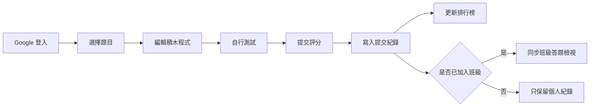
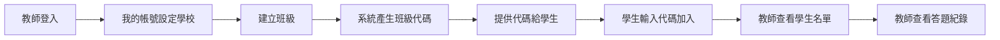
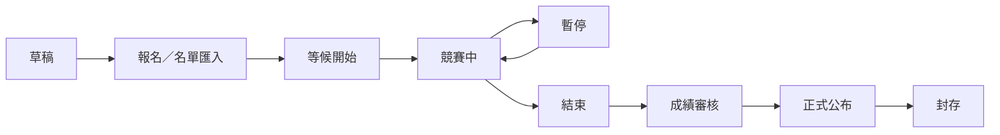

# 宜蘭縣資訊科技創意實作競賽平台系統規格書

## 1. 文件資訊

| 項目 | 內容 |
| --- | --- |
| 文件名稱 | 宜蘭縣資訊科技創意實作競賽平台系統規格書 |
| 文件版本 | v2.0，目前實作版 |
| 最後更新 | 2026-09-15 |
| 線上網站 | https://ilanictexam.pages.dev |
| 前端技術 | React、TypeScript、Vite、自訂 CSS |
| 後端與資料 | Firebase Authentication、Cloud Firestore |
| 部署平台 | Cloudflare Pages |
| 適用對象 | 超級管理者、教師、學生使用者 |

本文件描述目前平台已完成與可測試的功能。過去討論中的「正式競賽完整防作弊」、「伺服器端評分」、「PK 遊戲模式」、「徽章系統」等功能，已列入後續延伸設計，但不視為目前完成項目。

## 2. 系統定位

本平台是一套結合「練習平台」與「賽事管理雛型」的資訊科技創意實作競賽網站，主要目標如下：

1. 讓學生以 Google 帳號登入後進行題目練習、測試、評分與查看排行榜。
2. 讓教師可以建立班級，透過班級代碼讓學生加入，並查看班級學生名單與答題紀錄。
3. 讓超級管理者可以管理題目、學校、帳號、使用者、賽事資料與使用者解題紀錄。
4. 預留每年賽事可獨立管理的流程：

   `草稿 → 報名／名單匯入 → 等候開始 → 競賽中 → 暫停 → 結束 → 成績審核 → 正式公布 → 封存`

目前版本適合做為練習平台、教師班級追蹤與賽事管理流程雛型。若要作為正式競賽使用，仍建議補上後端評分、正式計時、防重複提交、防作弊與稽核紀錄等安全機制。

## 3. 使用者角色與權限

目前系統採三層角色：

| 角色 | 說明 | 主要權限 |
| --- | --- | --- |
| 超級管理者 | 系統最高權限管理者 | 可進入管理後台，管理所有題目、使用者、學校、賽事、名單與答題紀錄 |
| 教師 | 可開設班級與管理自己班級的教師 | 可建立班級、查看班級學生名單、查看班級學生答題紀錄 |
| 學生使用者 | 一般解題者 | 可登入、練習、提交評分、查看自己的紀錄、輸入班級代碼加入班級 |

### 3.1 Email 網域判斷

目前系統會依 Email 網域協助判斷身分提示：

| Email 網域 | 預設判斷 |
| --- | --- |
| `tmail.ilc.edu.tw` | 教師 |
| `smail.ilc.edu.tw` | 學生 |

但「所屬學校」不再依網域自動判斷，因各校網域條件不一致。教師可在「我的帳號」設定自己的學校，超級管理者也可在後台調整教師與使用者的學校資料。

### 3.2 權限邊界

目前權限設計重點如下：

- 競賽資料目前僅開放超級管理者管理與查看。
- 一般教師初步沒有競賽資料權限。
- 教師只管理自己建立的班級與班級中的學生資料。
- 學生只能查看與操作自己的帳號、提交紀錄與班級加入資料。
- 未來可再擴充「教師是否能查看指定賽事、指定學校資料」等細部權限。

## 4. 主要功能總覽

| 模組 | 目前狀態 | 說明 |
| --- | --- | --- |
| Google 登入 | 已完成 | 使用 Firebase Authentication 進行登入 |
| 題目練習 | 已完成 | 題目瀏覽、程式積木操作、自行測試與提交評分 |
| 評分紀錄 | 已完成 | 儲存使用者提交紀錄與每題統計 |
| 排行榜 | 已完成 | 題目排行榜與全站排行榜 |
| 我的帳號 | 已完成 | 顯示姓名、Email、角色、帳號狀態、Email 網域、所屬學校 |
| 教師我的班級 | 已完成 | 班級管理、學生名單、答題紀錄三個分頁 |
| 超管管理後台 | 已完成 | 賽事、學校帳號、題目、使用者、解題資料管理 |
| 賽事流程管理 | 已完成雛型 | 可建立年度賽事與設定流程狀態 |
| 匯入參賽名單 | 已完成雛型 | 支援 Email 與姓名資料匯入，依設定學校資料進行對應 |
| PK 對戰模式 | 尚未實作 | 已列入延伸設計 |
| 徽章系統 | 尚未實作 | 已列入延伸設計 |
| 正式競賽後端評分 | 尚未實作 | 目前仍以前端評分為主 |

## 5. 前台解題功能規格

### 5.1 題目瀏覽

使用者可在左側題目清單選擇題目。題目可依年度與分類進行篩選。

題目資料包含：

- 題目編號
- 題目標題
- 年度
- 類別
- 難度
- 題目說明
- 輸入說明
- 輸出說明
- 範例測資
- 評分測資
- 狀態：草稿、已發布、封存

一般使用者只會看到可公開使用的題目。題目的新增、修改、匯入與刪除由超級管理者負責。

### 5.2 程式積木編輯

目前平台提供 Blockly / Scratch 風格的積木編輯環境，使用者可：

- 編輯解題程式
- 重設工作區
- 匯入 XML
- 匯出 XML
- 自動儲存目前題目的工作區內容至瀏覽器本機資料

每位使用者、每一道題目會有各自的本機暫存內容，方便學生下次回來繼續練習。

### 5.3 自行測試

使用者可在「自行測試」分頁輸入測試資料，系統會在瀏覽器中執行目前積木轉換後的程式，並顯示：

- 程式輸出
- 是否執行成功
- 錯誤訊息
- 執行時間

### 5.4 評分

使用者可在「評分」分頁提交程式，系統會依題目的測資執行評分。

評分結果包含：

- 通過測資數
- 總測資數
- 通過率
- 分數
- 執行時間
- 各測資輸出結果
- 錯誤訊息

目前評分是在前端瀏覽器中透過 Web Worker 執行。這種方式適合練習平台與展示，但正式競賽仍應改為伺服器端評分，避免使用者繞過前端邏輯。

### 5.5 提交次數限制

目前每位使用者每題最多可正式提交 10 次。系統會在使用者紀錄中統計：

- 提交次數
- 最佳分數
- 最佳通過率
- 最佳執行時間
- 最後提交時間

### 5.6 評分紀錄

使用者可查看自己的提交紀錄。超級管理者可在後台查看所有使用者的答題紀錄。

教師可在「我的班級」中查看自己班級學生的答題紀錄。班級答題紀錄目前是從學生加入班級後的新提交資料同步建立；功能完成前已存在的舊提交資料不會自動回填，若需要可另做資料回填工具。

### 5.7 排行榜

目前平台提供：

- 單題排行榜
- 全站排行榜

排行榜排序主要依據：

- 通過率
- 分數
- 執行時間
- 提交次數
- 最後提交時間
- 使用者名稱

排行榜目前適合練習與展示使用。正式競賽排行榜若要公開發布，仍建議加入成績審核流程、異常紀錄檢查與後端統計。

## 6. 我的帳號功能規格

使用者登入後可在「我的帳號」查看：

- 姓名
- Email
- 身分
- 帳號狀態
- Email 網域
- 所屬學校

教師可在此設定自己的學校。超級管理者也能在後台協助調整教師或使用者的學校設定。

帳號狀態支援：

- 啟用
- 停用

若帳號被停用，系統會限制使用者繼續使用需登入的功能。

## 7. 教師「我的班級」功能規格

教師登入後，可看到「我的班級」功能。此功能目前已調整為類似管理後台的全畫面模式，方便教師操作大量資料。

教師班級管理分為三個標籤：

1. 班級管理
2. 學生名單
3. 答題紀錄

### 7.1 班級管理

教師可建立自己的班級。每個班級會自動產生班級代碼，學生登入後可在「我的帳號」輸入班級代碼加入。

班級資料包含：

- 班級名稱
- 建立教師
- 所屬學校
- 班級代碼
- 是否開放加入
- 建立時間
- 更新時間
- 班級狀態

教師可查看：

- 班級代碼
- 班級是否開放加入
- 已加入學生數
- 班級答題紀錄數

### 7.2 學生加入流程

學生加入班級流程：

1. 學生使用 Google 帳號登入。
2. 進入「我的帳號」。
3. 輸入教師提供的班級代碼。
4. 系統確認班級存在且開放加入。
5. 學生自動加入該班級。

此設計比要求教師逐一新增學生更方便，也較符合免費雲端服務的限制，因為不需要額外建立大量後端邀請流程或批次帳號管理服務。

### 7.3 學生名單

教師可在「學生名單」查看自己班級中的學生，包含：

- 學生姓名
- Email
- 加入時間
- 狀態

教師可將學生從班級移除，也可恢復被移除的學生關聯。

### 7.4 答題紀錄

教師可在「答題紀錄」查看自己班級學生的提交紀錄，包含：

- 學生姓名
- Email
- 題目
- 分數
- 通過率
- 執行時間
- 提交時間

此資料來自 `classSubmissionViews`，目的是讓教師只能看到自己班級需要的資料，而不直接讀取全站所有提交紀錄。

## 8. 超級管理者後台規格

超級管理者登入後，可進入「管理」頁面。管理頁面目前會以全畫面方式展開，不會被題目編輯區擠壓。

後台主要標籤如下：

| 標籤 | 功能 |
| --- | --- |
| 賽事管理 | 建立與管理年度賽事、設定流程狀態 |
| 學校帳號 | 管理學校、學校預先匯入帳號與賽事名單 |
| 題目管理 | 新增、編輯、匯入、封存題目 |
| 使用者管理 | 查看使用者、篩選教師／學生／學校、調整權限 |
| 使用者解題資料 | 查看所有使用者答題狀態與提交紀錄 |

### 8.1 賽事管理

賽事資料設計支援每年建立一個或多個賽事。

賽事狀態流程：

1. 草稿
2. 報名／名單匯入
3. 等候開始
4. 競賽中
5. 暫停
6. 結束
7. 成績審核
8. 正式公布
9. 封存

賽事資料包含：

- 賽事名稱
- 年度
- 模式：練習、競賽、混合
- 狀態
- 報名開始時間
- 報名結束時間
- 競賽開始時間
- 競賽結束時間
- 指定題目
- 參賽人數
- 設定資料
- 備註

目前賽事管理主要完成資料建立、狀態設定與流程控制介面。正式競賽的時間鎖定、題目鎖定與強制防作弊尚未完全後端化。

### 8.2 學校管理

超級管理者可管理學校資料。

學校資料包含：

- 學校名稱
- 學校代碼
- 網域設定
- 是否啟用
- 建立時間
- 更新時間

目前因實際上各校學生帳號網域不一定能直接對應學校，所以系統已保留人工指定與超管調整機制。

### 8.3 學校帳號管理

超級管理者可在指定學校下新增預先匯入帳號，資料格式以簡化為主：

- Email
- 姓名

此功能可用於賽前建立學生帳號名單或學校帳號清單。使用者實際登入後，系統可再依 Email 與既有資料進行對應。

### 8.4 賽事名單匯入

系統支援匯入賽事名單資料，設計目標是讓超級管理者可在賽前完成參賽者名單準備。

目前名單資料主要包含：

- Email
- 姓名
- 對應賽事
- 對應學校
- 名單狀態

未來若要支援更穩定的大量匯入，建議加入：

- 匯入預覽
- 重複 Email 檢查
- 錯誤列下載
- 匯入批次編號
- 匯入紀錄查詢

### 8.5 題目管理

超級管理者可管理題目資料。

支援操作：

- 新增題目
- 編輯題目
- 匯入題目
- 發布題目
- 封存題目
- 刪除未被使用的題目

題目可包含公開範例測資與隱藏評分測資。現階段隱藏測資仍屬前端資料結構的一部分，正式競賽不應完全依賴前端隱藏測資。

### 8.6 使用者管理

超級管理者可在使用者管理頁面查看全站使用者。

目前已增加篩選功能：

- 全部使用者
- 教師
- 學生
- 指定學校

頁面會顯示目前篩選結果中的：

- 使用者總數
- 教師數
- 學生數
- 尚未設定學校人數

超級管理者可執行：

- 設定使用者為超級管理者
- 設定使用者為教師
- 指定教師所屬學校
- 啟用使用者
- 停用使用者
- 清除使用者提交紀錄
- 刪除使用者資料

刪除使用者時，系統會同步清理相關資料，包含提交紀錄、統計、排行榜與班級關聯資料。Firebase Authentication 帳號本身目前不由前端直接刪除，因這通常需要後端管理權限。

### 8.7 使用者解題資料

超級管理者可查看所有使用者的解題狀態與提交紀錄。

可查看資訊包含：

- 使用者
- Email
- 題目
- 提交次數
- 最佳分數
- 最佳通過率
- 最佳執行時間
- 最後提交時間
- 詳細提交紀錄

此功能可作為練習期間觀察學生進度，或賽後進行初步成績檢查。

## 9. 資料模型規格

目前主要資料集合如下：

| Firestore 集合 | 用途 |
| --- | --- |
| `users` | 使用者基本資料、角色、狀態、學校 |
| `admins` | 管理者角色資料，包含超級管理者與教師管理資料 |
| `settings` | 系統設定與超管初始化狀態 |
| `problems` | 題目資料 |
| `contests` | 年度賽事資料 |
| `schools` | 學校資料 |
| `contestRoster` | 賽事參賽名單 |
| `schoolAccounts` | 學校預先匯入帳號 |
| `classes` | 教師建立的班級 |
| `classMembers` | 班級學生關聯 |
| `classSubmissionViews` | 教師可讀取的班級答題紀錄 |
| `submissions` | 使用者提交紀錄 |
| `userProblemStats` | 使用者每題統計 |
| `leaderboards` | 排行榜資料 |

### 9.1 使用者資料

使用者資料主要欄位：

- UID
- Email
- 顯示名稱
- 頭像
- 角色
- Email 網域
- 所屬學校
- 是否停用
- 建立時間
- 最後登入時間

### 9.2 管理者資料

管理者資料主要欄位：

- UID
- Email
- 姓名
- 角色：super 或 teacher
- 指派學校
- 是否啟用
- 建立時間
- 更新時間

### 9.3 班級資料

班級資料主要欄位：

- 班級 ID
- 教師 UID
- 教師 Email
- 教師姓名
- 學校 ID
- 學校名稱
- 班級名稱
- 班級代碼
- 是否開放加入
- 狀態
- 建立時間
- 更新時間

### 9.4 班級成員資料

班級成員資料主要欄位：

- 班級 ID
- 學生 UID
- 學生 Email
- 學生姓名
- 教師 UID
- 學校 ID
- 加入時間
- 狀態：active 或 removed

### 9.5 班級答題檢視資料

班級答題檢視資料主要欄位：

- 班級 ID
- 教師 UID
- 學生 UID
- 學生 Email
- 學生姓名
- 題目 ID
- 題目標題
- 分數
- 通過率
- 執行時間
- 提交時間
- 原始提交 ID

此集合是為教師權限特別設計的衍生資料，避免教師直接讀取全站 `submissions`。

## 10. Firestore 權限規則概要

目前 Firestore Rules 採「以超級管理者為最高權限，教師只看自己班級，學生只看自己資料」的方向。

| 資料 | 超級管理者 | 教師 | 學生 |
| --- | --- | --- | --- |
| 使用者資料 | 可讀寫所有使用者 | 可讀必要的自己資料 | 可讀寫自己的部分資料 |
| 管理者資料 | 可讀寫 | 可讀寫自己的教師資料限制欄位 | 不可管理 |
| 題目資料 | 可讀寫 | 可讀已開放題目 | 可讀已開放題目 |
| 賽事資料 | 可讀寫 | 目前不開放 | 目前不開放 |
| 學校資料 | 可讀寫 | 可讀必要資料 | 可讀必要資料 |
| 學校帳號 | 可讀寫 | 預留指定學校權限，前台目前未全面開放 | 不可管理 |
| 班級資料 | 可讀寫 | 可讀寫自己建立的班級 | 可讀可加入班級的必要資料 |
| 班級成員 | 可讀寫 | 可管理自己班級學生 | 可建立或查看自己的班級關聯 |
| 班級答題檢視 | 可讀寫 | 可讀自己班級答題紀錄 | 可建立自己的提交檢視 |
| 提交紀錄 | 可讀寫 | 不直接讀全站提交 | 可讀寫自己的提交 |
| 排行榜 | 可讀寫 | 可讀 | 可讀 |

## 11. 主要操作流程

### 11.1 學生練習流程

### 11.2 教師班級流程

### 11.3 年度賽事流程

## 12. 部署與環境規格

### 12.1 前端部署

目前網站部署於 Cloudflare Pages。

- 正式網址：https://ilanictexam.pages.dev
- 建置工具：Vite
- 輸出目錄：`dist`

### 12.2 Firebase

目前使用 Firebase：

- Firebase Authentication：Google 登入
- Cloud Firestore：資料儲存與權限控管
- Firebase 專案：`fileupload-d96f5`

### 12.3 本機開發

本機可使用 Vite 開發伺服器進行測試。若 Firebase 設定不存在，部分資料會回退至本機儲存模式，方便開發與展示。

## 13. 非功能性需求

### 13.1 安全性

目前已透過 Firestore Rules 區隔角色權限。正式競賽版本仍需加強：

- 伺服器端評分
- 伺服器端時間控管
- 防止前端竄改成績
- 操作紀錄與稽核紀錄
- 管理者操作紀錄
- 大量匯入防呆與錯誤回復

### 13.2 效能

目前為單頁式前端應用。使用者數增加後，建議加入：

- 後台列表分頁
- 條件查詢索引
- 大量提交紀錄查詢最佳化
- 前端程式碼分割
- 排行榜快取或後端彙整

### 13.3 可維護性

目前已將主要功能拆分為：

- 認證與帳號服務
- 題目資料服務
- 評分服務
- 提交紀錄服務
- 管理資料服務
- 班級資料服務

後續若要正式化競賽系統，建議再加入雲端函式或後端服務，將敏感邏輯從前端移到伺服器。

### 13.4 免費雲端服務限制

目前架構盡量使用 Firebase 與 Cloudflare Pages 的免費或低成本服務。此設計適合練習平台與中小型賽事管理，但若同時上線人數、提交次數或即時監控需求增加，需注意：

- Firestore 讀寫次數
- 大量排行榜更新成本
- 使用者列表讀取量
- 即時監控資料同步量
- 前端評分造成的瀏覽器效能差異

## 14. 目前已知限制

1. 正式競賽尚未完全後端化，前端評分不適合作為最終正式成績唯一依據。
2. 隱藏測資目前仍可能存在於前端資料結構中，正式競賽需改由後端保存與評分。
3. 教師班級答題紀錄只會同步功能完成後的新提交，舊資料需另行回填。
4. PK 對戰、勝敗紀錄、徽章系統尚未實作。
5. Firebase Authentication 使用者帳號本體刪除需後端 Admin SDK，目前前端只刪除平台資料。
6. 賽事狀態目前以管理資料與介面為主，尚未完整強制限制所有前端操作。
7. 大量資料情境下，後台使用者管理與提交紀錄需要進一步分頁與索引最佳化。

## 15. 後續分段實作建議

### 第一階段：目前功能穩定化

- 修正教師班級管理介面細節
- 完成學校與使用者篩選體驗
- 補強匯入格式錯誤提示
- 增加提交紀錄與班級紀錄回填工具
- 加入更清楚的權限錯誤診斷訊息

### 第二階段：正式賽事模式

- 將評分移至後端
- 賽事題目鎖定
- 賽事時間由伺服器判斷
- 競賽開始與結束自動切換
- 成績審核後才公開排行榜
- 匯出成績報表

### 第三階段：教師與學校管理擴充

- 超管指派教師管理學校或班級群組
- 教師可批次匯入學生
- 教師可匯出班級學生答題資料
- 學校管理者角色若未來需要，可再獨立於教師角色之外

### 第四階段：互動與遊戲化

- PK 自動配對
- 指定題目對戰
- 勝敗紀錄
- 連勝紀錄
- 徽章系統
- 活躍度任務
- 班級挑戰榜

## 16. 驗收重點

目前版本可依下列項目驗收：

- 學生可正常登入並進行題目練習。
- 學生可自行測試與提交評分。
- 學生提交後會更新個人紀錄與排行榜。
- 教師可進入「我的班級」全畫面管理頁。
- 教師可建立班級並取得班級代碼。
- 學生可輸入班級代碼加入班級。
- 教師可查看班級學生名單。
- 學生加入班級後的新提交可出現在教師答題紀錄。
- 超級管理者可進入管理後台。
- 超級管理者可管理賽事流程、學校、學校帳號、題目、使用者與解題紀錄。
- 超級管理者可用教師、學生、學校條件篩選使用者。
- 超級管理者可啟用、停用、調整角色、清除提交或刪除使用者平台資料。

