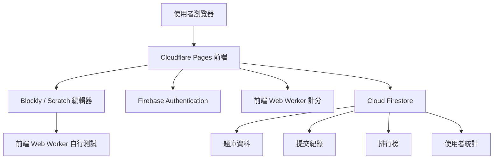

# 宜蘭縣資訊科技創意實作競賽軟體規格書

## 1. 文件資訊

| 項目 | 內容 |
|---|---|
| 文件名稱 | 宜蘭縣資訊科技創意實作競賽軟體規格書 |
| 文件版本 | v1.0 |
| 建議平台 | Cloudflare Pages、Firebase Authentication、Cloud Firestore |
| 主要用途 | 資訊科技競賽、程式實作練習、Blockly/Scratch 視覺化解題教學 |
| 目標使用者 | 學生、教師、管理者、訪客使用者 |

## 2. 系統目標

本系統旨在建置一套線上 Blockly/Scratch 風格程式解題平台，提供學生以視覺化積木進行程式實作、測試、前端計分，並提供教師或管理者匯入題目、管理測資、查看解題紀錄、答題率與排行榜。

系統需同時支援訪客模式與註冊使用者模式。訪客可進行練習與本機測試；註冊使用者可透過 Gmail 登入，保存解題紀錄、評分結果與排行榜成績。本版本為純前端計分練習版，不保證正式競賽防作弊。

## 3. 系統範圍

### 3.1 包含範圍

- Blockly / Scratch 風格解題介面。
- 題目列表與題目說明頁。
- 題目匯入功能。
- 公開測資自行測試功能。
- 前端計分功能。
- Firebase Gmail 登入。
- 訪客模式。
- 解題紀錄保存。
- 答題時間、答題率、得分統計。
- 使用者排行榜。
- 管理者後台。

### 3.2 不包含範圍

- 多語言文字程式碼線上編譯器。
- 原生手機 App。
- 付費系統。
- 即時多人協作編輯。
- 高強度沙盒執行環境，例如容器級隔離或完整 Linux 沙盒。

## 4. 使用者角色

| 角色 | 說明 | 權限 |
|---|---|---|
| 訪客 | 未登入使用者 | 瀏覽題目、使用 Blockly 解題、自行測試、暫存本機紀錄 |
| 註冊使用者 | 使用 Gmail 登入者 | 訪客功能、正式送出、保存解題紀錄、參與排行榜 |
| 教師 / 出題者 | 具題目管理權限者 | 新增、匯入、編輯、停用題目與測資 |
| 管理者 | 系統最高權限者 | 使用者管理、題庫管理、排行榜管理、系統設定 |

## 5. 平台與技術架構

### 5.1 建議技術選型

| 層級 | 技術 | 用途 |
|---|---|---|
| 前端框架 | React + Vite + TypeScript | 建置單頁應用程式 |
| UI 樣式 | Tailwind CSS | 快速建立一致介面 |
| Blockly 編輯器 | Google Blockly | 積木式程式設計 |
| 前端部署 | Cloudflare Pages | 部署靜態前端與全球 CDN |
| 使用者登入 | Firebase Authentication | Gmail 登入、匿名訪客 |
| 資料庫 | Cloud Firestore | 題庫、紀錄、排行榜 |
| 後端 API | 無 | MVP 不使用 Cloud Functions、Workers 或 Pages Functions |
| 防濫用 | Cloudflare Turnstile | 防止大量機器人送出 |

### 5.2 系統架構



## 6. 功能需求

### FR-001 題目列表

系統應提供題目列表頁，顯示所有可作答題目。

功能需求：

- 顯示題目名稱。
- 顯示題目狀態，例如公開、草稿、停用。
- 顯示使用者作答狀態，例如未開始、已作答、已滿分。
- 支援依分類、難度或關鍵字篩選。

### FR-002 題目說明

系統應提供題目說明頁。

內容包含：

- 題目名稱。
- 問題描述。
- 輸入格式。
- 輸出格式。
- 範例輸入。
- 範例輸出。
- 範例說明。
- 限制條件。

### FR-003 Blockly / Scratch 解題介面

系統應提供視覺化積木編輯器。

功能需求：

- 顯示 Blockly 工作區。
- 提供事件、控制、運算、變數、清單、函式等類別。
- 支援 Scratch 風格起始積木，例如「點擊綠旗」。
- 支援將積木轉換為 JavaScript。
- 支援保存 Blockly XML。
- 支援載入歷史作答 XML。
- 支援重設工作區。

### FR-004 自行測試

系統應提供自行測試功能。

功能需求：

- 使用者可輸入測試資料。
- 系統在前端 Web Worker 執行使用者程式。
- 顯示程式輸出。
- 顯示執行錯誤。
- 限制執行時間。
- 限制輸出長度。
- 自行測試結果不進入正式排行榜。

### FR-005 前端計分

系統應提供前端計分功能。

功能需求：

- 登入使用者可送出計分結果並寫入排行榜。
- 訪客可計分，但僅保存於本機 localStorage。
- 前端 Web Worker 執行 Blockly 產生後的 JavaScript。
- 題目測資與答案由前端讀取；hidden 僅代表 UI 隱藏，不代表真正保密。
- 前端逐筆測資比對答案。
- 回傳總分、通過測資數、答題率、錯誤訊息。
- 寫入提交紀錄。
- 更新使用者題目統計。
- 更新排行榜。

### FR-006 題目匯入

系統應提供題目匯入功能。

支援格式：

- JSON，第一階段優先支援。
- CSV，第二階段支援。
- Excel，第二階段支援。

題目匯入資料需包含：

- 題目名稱。
- 題目描述。
- 範例測資。
- 公開測資。
- hidden 測資欄位，僅作 UI 隱藏用途。
- 每筆測資分數。
- 題目分類與難度。

### FR-007 訪客模式

系統應支援未登入使用者使用。

訪客可使用：

- 題目瀏覽。
- Blockly 編輯。
- 自行測試。
- 本機暫存作答內容。

訪客限制：

- 不可進入正式排行榜。
- 不保證跨裝置保存紀錄。
- 若要保存正式紀錄，需登入 Gmail。

### FR-008 Gmail 登入

系統應支援 Firebase Authentication 的 Google 登入。

登入後應取得：

- Firebase UID。
- Gmail 信箱。
- 顯示名稱。
- 使用者頭像。

登入後可使用：

- 正式提交。
- 雲端保存解題紀錄。
- 排行榜排名。
- 歷史紀錄查詢。

### FR-009 解題紀錄

系統應紀錄使用者解題歷程。

紀錄內容：

- 使用者 ID。
- 題目 ID。
- 開始作答時間。
- 自行測試次數。
- 正式提交時間。
- Blockly XML。
- 產生後 JavaScript。
- 得分。
- 通過測資數。
- 總測資數。
- 答題率。
- 執行錯誤。
- 使用模式，例如 Blockly 或 Scratch。

### FR-010 答題率統計

系統應提供答題率統計。

統計項目：

- 個人每題最高分。
- 個人每題答題率。
- 個人總答題率。
- 題目整體通過率。
- 題目平均得分。
- 題目平均完成時間。

### FR-011 排行榜

系統應提供排行榜功能。

排行榜類型：

- 單題排行榜。
- 總分排行榜。
- 班級排行榜，若未來加入班級管理。

排序規則建議：

1. 分數高者優先。
2. 同分時，正式完成時間較早者優先。
3. 再同分時，提交次數較少者優先。
4. 再同分時，總執行步數較少者優先，若有紀錄。

### FR-012 管理後台

管理者應可使用後台管理系統資料。

功能需求：

- 新增題目。
- 匯入題目。
- 編輯題目。
- 設定題目是否公開。
- 管理公開測資與隱藏測資。
- 查看使用者作答紀錄。
- 查看排行榜。
- 重算排行榜。
- 停用異常提交紀錄。

## 7. 非功能需求

### NFR-001 效能

- 題目列表頁初次載入應在一般網路下 3 秒內完成。
- 自行測試應在 3 秒內回應，超時需中止。
- 前端計分建議在 3 秒內完成。

### NFR-002 安全性

- 本版本排行榜採用前端計分結果，僅適合練習與展示。
- hidden 測資會被前端讀取，不具正式保密性。
- 若未來作為正式競賽，應升級為後端評分。
- Firestore Security Rules 必須限制使用者只能讀寫自己的紀錄。
- 管理功能需檢查管理者角色。
- 前端不得包含任何 Firebase 管理金鑰或伺服器密鑰。

### NFR-003 可用性

- 系統應支援桌機與平板。
- 手機可瀏覽題目與排行榜，但不作為主要 Blockly 編輯裝置。
- UI 需支援繁體中文。

### NFR-004 可維護性

- 題目資料與前端程式需分離。
- 評分邏輯需集中於前端 gradingEngine 與 Web Worker，方便未來替換為後端評分。
- Blockly 積木定義需模組化。
- 資料結構需支援題目版本化。

### NFR-005 可擴充性

系統未來應可擴充：

- 班級管理。
- 教師派題。
- 多競賽活動。
- 多語言題目。
- 匯出成績報表。

## 8. 資料庫規格

### 8.1 users

| 欄位 | 型別 | 說明 |
|---|---|---|
| uid | string | Firebase 使用者 ID |
| email | string | 使用者 Email |
| displayName | string | 顯示名稱 |
| photoURL | string | 頭像 |
| role | string | guest、user、teacher、admin |
| createdAt | timestamp | 建立時間 |
| lastLoginAt | timestamp | 最後登入時間 |

### 8.2 problems

| 欄位 | 型別 | 說明 |
|---|---|---|
| id | string | 題目 ID |
| title | string | 題目名稱 |
| slug | string | 題目代稱 |
| description | string | 題目描述 |
| inputFormat | string | 輸入格式 |
| outputFormat | string | 輸出格式 |
| difficulty | string | 難度 |
| category | string | 分類 |
| status | string | draft、published、archived |
| version | number | 題目版本 |
| toolboxConfig | object | Blockly 工具箱設定 |
| createdAt | timestamp | 建立時間 |
| updatedAt | timestamp | 更新時間 |

### 8.3 testCases

| 欄位 | 型別 | 說明 |
|---|---|---|
| id | string | 測資 ID |
| problemId | string | 題目 ID |
| groupTitle | string | 測資群組 |
| input | string | 輸入資料 |
| output | string | 預期輸出 |
| score | number | 分數 |
| visibility | string | public、hidden |
| order | number | 排序 |

### 8.4 submissions

| 欄位 | 型別 | 說明 |
|---|---|---|
| id | string | 提交 ID |
| uid | string | 使用者 ID |
| problemId | string | 題目 ID |
| problemVersion | number | 題目版本 |
| mode | string | Blockly、Scratch |
| blocklyXml | string | 積木 XML |
| generatedCode | string | 產生後 JavaScript |
| score | number | 得分 |
| maxScore | number | 滿分 |
| passedCases | number | 通過測資數 |
| totalCases | number | 總測資數 |
| passRate | number | 答題率 |
| elapsedSeconds | number | 作答秒數 |
| status | string | accepted、partial、failed、error |
| errorMessage | string | 錯誤訊息 |
| createdAt | timestamp | 提交時間 |

### 8.5 userProblemStats

| 欄位 | 型別 | 說明 |
|---|---|---|
| uid | string | 使用者 ID |
| problemId | string | 題目 ID |
| bestScore | number | 最高分 |
| bestPassRate | number | 最高答題率 |
| bestSubmissionId | string | 最佳提交 ID |
| submitCount | number | 正式提交次數 |
| testCount | number | 自行測試次數 |
| firstStartedAt | timestamp | 第一次開始時間 |
| firstAcceptedAt | timestamp | 第一次滿分時間 |
| updatedAt | timestamp | 更新時間 |

### 8.6 leaderboards

| 欄位 | 型別 | 說明 |
|---|---|---|
| scope | string | problem、global |
| problemId | string | 題目 ID，總榜可為空 |
| uid | string | 使用者 ID |
| displayName | string | 顯示名稱 |
| score | number | 分數 |
| passRate | number | 答題率 |
| elapsedSeconds | number | 作答秒數 |
| submitCount | number | 提交次數 |
| rankedAt | timestamp | 排名更新時間 |

## 9. API 規格

### 9.1 importProblems

用途：匯入題目資料。

權限：teacher、admin。

輸入：

```json
{
  "problems": [
    {
      "title": "可口便當",
      "description": "...",
      "examples": [],
      "cases": []
    }
  ]
}
```

輸出：

```json
{
  "success": true,
  "importedCount": 1,
  "errors": []
}
```

### 9.2 submitSolution

用途：正式送出評分。

權限：登入使用者。

輸入：

```json
{
  "problemId": "problem_001",
  "mode": "Scratch",
  "blocklyXml": "<xml>...</xml>",
  "generatedCode": "..."
}
```

輸出：

```json
{
  "submissionId": "sub_001",
  "score": 80,
  "maxScore": 100,
  "passedCases": 8,
  "totalCases": 10,
  "passRate": 0.8,
  "status": "partial"
}
```

### 9.3 getLeaderboard

用途：取得排行榜。

權限：公開讀取，或依競賽設定限制。

輸入：

```json
{
  "scope": "problem",
  "problemId": "problem_001",
  "limit": 50
}
```

輸出：

```json
{
  "items": [
    {
      "rank": 1,
      "uid": "user_001",
      "displayName": "學生A",
      "score": 100,
      "elapsedSeconds": 320
    }
  ]
}
```

### 9.4 getUserStats

用途：取得使用者解題統計。

權限：本人或管理者。

輸出：

```json
{
  "uid": "user_001",
  "solvedCount": 5,
  "attemptedCount": 8,
  "averagePassRate": 0.76,
  "totalScore": 420
}
```

## 10. 評分流程規格

前端計分流程如下：

1. 使用者在前端點擊「正式計分」。
2. 前端取得目前題目測資、Blockly XML 與產生後的 JavaScript。
3. 前端 Web Worker 執行使用者程式。
4. 每筆測資設定 timeout 與輸出長度上限。
5. 比對輸出結果。
6. 計算分數與答題率。
7. 訪客結果寫入 localStorage。
8. 登入使用者結果寫入 `submissions`。
9. 更新 `userProblemStats`。
10. 更新 `leaderboards`。
11. 前端顯示評分結果。

## 11. 題目匯入 JSON 格式

```json
{
  "title": "可口便當",
  "description": "可口便當主廚處理餐點...",
  "inputFormat": "第一行輸入訂單數量...",
  "outputFormat": "輸出套餐處理順序...",
  "difficulty": "easy",
  "category": "list",
  "examples": [
    {
      "title": "範例一",
      "input": "5\n8 9 9 9 8\n2\n9 8",
      "output": "9 9 9 8 8",
      "description": "先處理 9 號餐，再處理 8 號餐。"
    }
  ],
  "cases": [
    {
      "groupTitle": "基本測資",
      "caseTitle": "C1",
      "input": "5 8 9 9 9 8 2 9 8",
      "output": "9 9 9 8 8",
      "score": 10,
      "visibility": "public"
    },
    {
      "groupTitle": "隱藏測資",
      "caseTitle": "H1",
      "input": "...",
      "output": "...",
      "score": 10,
      "visibility": "hidden"
    }
  ]
}
```

## 12. 權限規則

| 資源 | 訪客 | 登入使用者 | 教師 | 管理者 |
|---|---|---|---|---|
| 查看公開題目 | 可 | 可 | 可 | 可 |
| 自行測試 | 可 | 可 | 可 | 可 |
| 正式提交 | 不可 | 可 | 可 | 可 |
| 查看自己紀錄 | 本機暫存 | 可 | 可 | 可 |
| 查看他人紀錄 | 不可 | 不可 | 可 | 可 |
| 匯入題目 | 不可 | 不可 | 可 | 可 |
| 編輯題目 | 不可 | 不可 | 可 | 可 |
| 管理使用者 | 不可 | 不可 | 不可 | 可 |

## 13. 前端頁面規格

### 13.1 題目列表頁

- 顯示題目卡片或表格。
- 顯示題目名稱、分類、難度、個人作答狀態。
- 提供進入題目按鈕。

### 13.2 解題頁

區塊配置：

- 左側：Blockly / Scratch 編輯器。
- 右側：題目說明、自行測試、正式評分、評分紀錄。
- 上方：登入狀態、題目列表、重設工作區。

### 13.3 自行測試頁籤

- 測試輸入框。
- 執行測試按鈕。
- 輸出結果區。
- 錯誤訊息區。

### 13.4 評分頁籤

- 正式送出按鈕。
- 顯示總分。
- 顯示每組測資通過狀態。
- 顯示答題率。

### 13.5 評分紀錄頁籤

- 顯示歷次提交時間。
- 顯示分數。
- 顯示答題率。
- 提供載入該次積木紀錄。

### 13.6 管理後台

- 題目列表。
- 題目編輯器。
- 測資編輯器。
- 題目匯入器。
- 使用者作答紀錄查詢。
- 排行榜管理。

## 14. 安全與限制規格

- 本版本為前端計分版，不具正式防作弊能力。
- hidden 測資只代表介面不直接顯示，仍可被前端讀取。
- 登入使用者的計分結果可寫入排行榜；訪客僅寫入 localStorage。
- 每位使用者每題正式計分需加上次數限制。
- 程式執行需限制 timeout。
- 程式輸出需限制最大長度。
- Blockly 工具箱需限制可用積木，避免產生危險程式碼。
- 管理後台需檢查角色權限。
- 若未來作為正式競賽，需升級為後端評分。

## 15. 部署規格

### 15.1 Cloudflare Pages

部署內容：

- React/Vite 前端。
- 靜態圖片。
- 前端 JavaScript bundle。
- CSS bundle。

建議環境：

- `preview`：測試環境。
- `production`：正式環境。

### 15.2 Firebase

使用服務：

- Firebase Authentication。
- Cloud Firestore。

建議環境：

- `dev` Firebase 專案。
- `prod` Firebase 專案。

## 16. 驗收標準

### 16.1 MVP 驗收

- 使用者可開啟題目列表。
- 使用者可進入題目。
- 使用者可使用 Blockly 建立程式。
- 使用者可自行測試。
- 使用者可 Gmail 登入。
- 登入後可送出前端計分結果。
- 系統可保存提交紀錄。
- 系統可顯示排行榜。

### 16.2 管理功能驗收

- 管理者可匯入題目。
- 管理者可設定 public / hidden 測資欄位。
- 管理者可查看提交紀錄。
- 管理者可停用題目。

### 16.3 限制驗收

- 未登入者計分結果不可寫入雲端排行榜。
- 介面需標示「前端計分版，不保證正式競賽防作弊」。
- 一般使用者不可進入題目管理頁。
- 前端計分需限制執行時間與輸出長度。

## 17. 開發時程建議

| 階段 | 工作內容 | 預估時間 |
|---|---|---|
| 第 1 階段 | 前端框架、Blockly 工作區、題目顯示、自行測試 | 3-4 週 |
| 第 2 階段 | Firebase Auth、Firestore 使用者紀錄 | 2 週 |
| 第 3 階段 | 前端 Web Worker 計分、提交紀錄 | 2-3 週 |
| 第 4 階段 | 題目匯入、管理後台 | 2-3 週 |
| 第 5 階段 | 排行榜、答題率、統計報表 | 2 週 |
| 第 6 階段 | 測試、安全檢查、正式部署 | 2 週 |

## 18. 優先開發版本

### v0.1 原型版

- 題目顯示。
- Blockly 編輯器。
- 前端自行測試。

### v0.2 登入版

- Gmail 登入。
- 使用者資料。
- 本機與雲端紀錄。

### v0.3 計分版

- 前端 Web Worker 計分。
- public / hidden 測資欄位。
- 提交紀錄。

### v0.4 競賽版

- 排行榜。
- 答題率。
- 管理後台。
- 題目匯入。

## 19. 結論

本系統建議採用 Cloudflare Pages 作為前端部署平台，Firebase 作為登入與資料庫平台。此架構能在免費資源條件下快速完成可用版本，並保留後續擴充正式競賽、班級管理與統計分析的能力。

若未來要作為正式競賽排名系統，應升級為後端評分，避免排行榜與正式成績被前端竄改。
